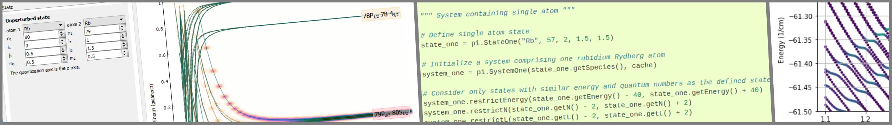

**************************************************
Pairinteraction — A Rydberg Interaction Calculator
**************************************************

|linux| |windows| |macos| |codecov| |benchs| |pypi| |arxiv| |license|

The *pairinteraction* software calculates properties of Rydberg systems.
The software consists of a Python library and a graphical user interface for pair potential calculations, making use of a high-performance C++ backend.
For usage examples visit the :ref:`tutorials <Tutorials>`.
Stay tuned by `signing up`_ for the newsletter so whenever there are updates to the software or new publications about pairinteraction we can contact you.
If you have a question that is related to problems, bugs, or suggests an improvement, consider raising an :github:`issue <issues>` on :github:`GitHub <>`.

Binary installers are available through :github:`GitHub Releases <releases>`.
For using pairinteraction as a Python 3 library, we recommend the installation via pip by calling

.. code-block:: bash

    pip install pairinteraction

If pairinteraction was installed via pip, the graphical user
interface can be started by executing ``start_pairinteraction_gui`` from the command line.

.. _signing up: https://goo.gl/forms/4bmz3qeuLjKfRlWJ3
.. _LGPL v3: https://www.gnu.org/licenses/lgpl-3.0.html
.. _GPL v3: https://www.gnu.org/licenses/gpl-3.0.html

.. role::  raw-html(raw)
    :format: html

**Please cite**

    Sebastian Weber, Christoph Tresp, Henri Menke, Alban Urvoy, Ofer Firstenberg, Hans Peter Büchler, Sebastian Hofferberth,
    *Tutorial: Calculation of Rydberg interaction potentials*,
    `J. Phys. B: At. Mol. Opt. Phys. 50, 133001 (2017) <https://doi.org/10.1088/1361-6455/aa743a>`_, `arXiv:1612.08053 <https://arxiv.org/abs/1612.08053>`_
    |references/pairinteraction|_

The pairinteraction software relies on quantum defects provided by the community.
Please consider citing relevant publications for your atomic species alongside pairinteraction:
``Li`` |references/Li|_,
``Na`` |references/Na|_,
``K`` |references/K|_,
``Rb`` |references/Rb|_,
``Cs`` |references/Cs|_,
``Sr88_singlet`` |references/Sr88_singlet|_,
``Sr88_triplet`` |references/Sr88_triplet|_,
``Sr88_mqdt`` |references/Sr88_mqdt|_,
``Sr87_mqdt`` |references/Sr87_mqdt|_.

.. |references/pairinteraction| replace:: :sup:`🙷Cite`
.. _references/pairinteraction: references/pairinteraction.html
.. |references/Li| replace:: :sup:`🙷Cite`
.. _references/Li: references/Li.html
.. |references/Na| replace:: :sup:`🙷Cite`
.. _references/Na: references/Na.html
.. |references/K| replace:: :sup:`🙷Cite`
.. _references/K: references/K.html
.. |references/Rb| replace:: :sup:`🙷Cite`
.. _references/Rb: references/Rb.html
.. |references/Cs| replace:: :sup:`🙷Cite`
.. _references/Cs: references/Cs.html
.. |references/Sr88_singlet| replace:: :sup:`🙷Cite`
.. _references/Sr88_singlet: references/Sr88_singlet.html
.. |references/Sr88_triplet| replace:: :sup:`🙷Cite`
.. _references/Sr88_triplet: references/Sr88_triplet.html
.. |references/Sr88_mqdt| replace:: :sup:`🙷Cite`
.. _references/Sr88_mqdt: references/Sr88_mqdt.html
.. |references/Sr87_mqdt| replace:: :sup:`🙷Cite`
.. _references/Sr87_mqdt: references/Sr87_mqdt.html

Documentation
=============

User Guide
    :doc:`overview` - Discover what the software is and its core features.

    :doc:`installation` - Whether you prefer binary installers or compiling from source, we've got all the information you need.

    :doc:`tutorials` - Covering both the graphical user interface and the Python library,
    these tutorials enable you to leverage pairinteraction for your projects.

Contributer Guide
    :doc:`ways` - Discover the many ways you can help improve pairinteraction, from contributing to the repository to providing quantum defects.

    :doc:`repo` - Ready to dive into development? Here's how to set up your environment for pairinteraction development,
    ensuring you have all the tools you need.

References
    :doc:`API Reference <modules>` - Documentation of classes and functions of pairinteraction's Python library.

    :doc:`Config Reference <config>` - Documentation of the configuration file for describing Rydberg systems.

Utility Tools
    :doc:`mqdt` - Learn how to calculate states and matrix elements using multi-channel quantum defect theory with our tool written in Julia.

    :doc:`databases` - Find out how to make states and matrix elements available to pairinteraction.

.. toctree::
    :maxdepth: 2
    :caption: User Guide
    :hidden:

    overview.rst
    installation.rst
    tutorials.rst
    development.rst

.. toctree::
    :maxdepth: 2
    :caption: Contributer Guide
    :hidden:

    ways.rst
    repo.rst

.. toctree::
    :maxdepth: 2
    :caption: References
    :hidden:

    modules.rst
    config.rst

.. toctree::
    :maxdepth: 2
    :caption: Utility Tools
    :hidden:

    mqdt.rst
    databases.rst

Credits
=======

The pairinteraction software was originally developed at the `5th Institute of Physics`_ and the `Institute for Theoretical Physics III`_ of the University of Stuttgart, Germany.
Currently it is maintained by developers at the `Institute for Theoretical Physics III`_ of the University of Stuttgart in Germany, the `Department of Physics`_ of the University of Otago in New Zealand,
the `Institute of Physics`_ of the University of Rostock in Germany, and the `Department of Physics, Chemistry and Pharmacy`_ of the University of Southern Denmark in Denmark.

.. _5th Institute of Physics: http://www.pi5.uni-stuttgart.de/
.. _Institute for Theoretical Physics III: http://www.itp3.uni-stuttgart.de/
.. _Department of Physics: http://www.otago.ac.nz/physics/index.html
.. _Department of Physics, Chemistry and Pharmacy: http://www.sdu.dk/en/fkf
.. _Institute of Physics: https://www.physik.uni-rostock.de/

License
=======

The pairinteraction library is licensed under the `LGPL v3`_. The extension for calculating
radial wave functions using Whittaker functions and the graphical user interface are licensed under the `GPL v3`_.
The GPL v3 also applies to the combined work and all provided binary builds.
