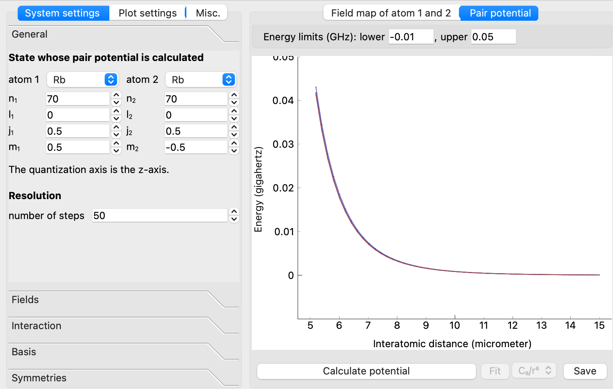

Introduction to the Graphical User Interface
============================================

Here we introduce how the graphical user interface (GUI) of pairinteraction can be used to calculate **interactions between Rydberg atoms** and **energy shifts in the presence of applied fields**. The underlying physics is discussed in our `tutorial <https://doi.org/10.1088/1361-6455/aa743a>`_.

.. _gui_intro_pair_potentials:

Rydberg Pair Potentials
-----------------------

In the image below you can see the window of the user interface. Here, it has been used to calculate interactions between two s-state Rydberg atoms in rubidium, at principal quantum numbers :math:`n=70`.

The config file :download:`settings_ss_rb.sconf <settings_ss_rb.sconf>` where all settings for this calculation are stored can be imported via ``File -> Open system settings ...`` in the upper left menu bar. Config files for more pair potential calculations used in scientific publications can be found in the tutorial about :ref:`macrodimer binding potentials <gui_macrodimers>`.

.. tip::
    Use the *mouse wheel* to zoom in and out of a plot. Place the *mouse cursor* on the energy/distance axis and use the mouse wheel to change the energy/distance range of the plot.

The different variables which can be chosen by the user are explained in the following.

- In the ``General`` tab:

  - The **atomic species** and **quantum numbers** :math:`n,l,j,m_j` of both interacting Rydberg atoms. If the same quantum numbers are used for both atoms, the interaction potential is typically dominated by van der Waals Rydberg interaction. If one chooses states with :math:`Δ_l = 1` (i.e., if the difference between ``l1`` and ``l2`` is one), the atoms interact via resonant dipole-dipole interactions.

  - The potentials are calculated by diagonalizing the Rydberg interaction Hamiltonian at various interatomic distances. The **resolution** can be specified by the number of steps.

- In the ``Fields`` tab, **external fields** :math:`E` and :math:`B` are specified:

  - For pair interaction calculations where only the distance is varied, one typically chooses identical field strength from start to end.

- In the ``Interaction`` tab, the **pair interaction** is specified:

  - The interatomic distance between the atoms at the **start and the end of the distance interval** where interactions should be calculated.

  - Also, the orientation of the atom pairs relative to the z-axis is tunable (per default, the atoms are parallel to the z-axis).

  - In the calculation, the interaction is treated in the **multipole expansion**. At large distances, it is usually good enough to use the lowest order multipole expansion where only dipole-dipole interactions are accounted for (:math:`1/R^3`). At closer distances, also higher order terms become important.

- In the ``Basis`` tab, the **number of states used for constructing** the Hamiltonian is specified:

  - One can select the states included in the single-atom basis via specifying an energy band. The same can be done for the states in the two-atom basis.

    .. note::
        For calculations of pair potentials, the single-atom bandwidth should be chosen to be rather large. The two-atom bandwidth can typically be restricted to a few gigahertz.

  - In addition, quantum numbers can be restricted. Because of the decreasing spatial overlap for large differences in :math:`n`, only Rydberg states with a similar :math:`n` quantum number as the state of interest have to be included. In addition, depending on the order of the multipole expansion, only specific states can be coupled directly (i.e., for dipole-dipole interactions, only states with :math:`Δ_l = 1` have finite coupling elements). The coupling of states that largely differ in the :math:`l` quantum number requires higher-order processes and is suppressed.

    .. note::
        If a quantum number should not be restricted, set the corresponding ``delta`` value to ``"-1"``. Typically, it is sufficient to only restrict the :math:`n` and :math:`l` quantum numbers for constructing the single-atom basis. The pair-basis does rarely need to be restricted further.

- In the ``Symmetries`` tab, **symmetries of the Hamiltonian** can be applied to restrict the basis:

  - Restricting the basis to the relevant subspaces shortens the computation time. This only works if external fields do not break the symmetry of the interaction Hamiltonian. For example, fields that are not pointing along the interatomic axis break rotation symmetry.

    .. note::
        Typically, it is best to let pairinteraction automatically determine which symmetries are applicable.

  - If both the checkboxes for the ``Odd`` and ``Even`` symmetry subspace are selected, the symmetry is used during calculation to make the Hamiltonian block-diagonal and the pair potentials of both subspaces are plotted.

The results are plotted in the GUI, ``Plot settings`` can be manually changed. The colormaps in the plots indicate the state overlap of the pair potentials with the chosen Rydberg state. The calculations can be exported using the save button. Under ``Misc.``, the settings for the export can be specified. In order to save memory, it makes sense to confine the exported states to the energy band where one is interested in. The calculated results can then be further processed (e.g. using Python or MATLAB). Under configuration, the **cache directory** can be specified.

.. tip::
    Under ``Misc.``, you can select the new Python API as an experimental backend. This might speed up the diagonalization. In addition, it enables the calculation of pair potentials for strontium in its singlet and triplet sector (the entries ``"Sr1"`` for the singlet sector and ``"Sr3"`` for the triplet sector are added to the list of selectable atomic species).

Stark Maps
----------

The user interface can also be very helpful to calculate energy shifts of Rydberg states in the presence of applied electric and magnetic fields :math:`E` and :math:`B`. Here, only single atom properties have to be specified. In the pairinteraction software, this is done by using the same quantum numbers for both atoms.

- The number of single-atom states included in the Stark maps can be specified by the single-atom bandwidth. Again, the quantum numbers of the Rydberg states used for the calculation can be specified. The two-atom energy bandwidth has no meaning in the Stark maps because Stark maps are single-atom properties.

- Also, the interatomic distance range varied in the calculation of Rydberg interactions is not included in the calculation of Stark maps. Instead, the E-field is varied at the start and the end of the calculation.

- Stark maps can also be calculated in the presence of magnetic fields :math:`B` (see the config file :download:`settings_stark_map.sconf <settings_stark_map.sconf>`), also the relative orientation between :math:`E` and :math:`B` can be specified in the GUI. In the experiment, this can be useful to obtain the background electric field and its orientation from spectroscopy between different Rydberg states since the splitting depends slightly on the orientation between both fields. Stark maps can also be calculated at high fields.

  .. figure:: stark_map.png
      :width: 500px
