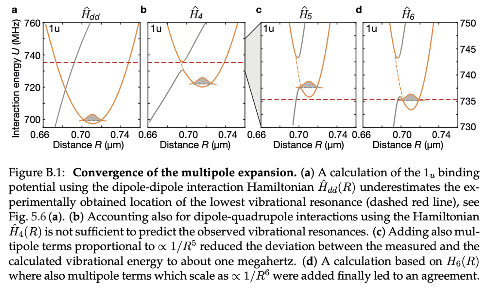

.. _gui_macrodimers:

Application: Vibrational Spectroscopy of Macrodimer Binding Potentials
======================================================================

`Macrodimers <cite https://pubs.acs.org/doi/10.1021/acs.jpca.2c08454>`_ are micrometer-seized diatomic molecules consisting of Rydberg pairs bound by their interactions. Macrodimer spectroscopy is currently the most precise way to benchmark Rydberg interactions because it provides narrow spectroscopic signatures and probes the interactions at short distances. For rubidium, the binding potentials can be calculated at high accuracy using the pairinteraction software. For more complicated atoms such as Sr or Yb, macrodimer spectroscopy may provide valuable insights into the details of their Rydberg interactions.

Here, we include config files that can be loaded in the :ref:`graphical user interface <gui_intro_pair_potentials>` for

- the :math:`0^{+}_g` potential observed blue-detuned from the :math:`35P_{1/2}` resonance [`1 <https://www.science.org/doi/10.1126/science.aaw4150>`_]: :download:`settings_0gp.sconf <settings_0gp.sconf>`
- the :math:`1_u` potential observed blue-detuned from the :math:`36P_{1/2}` resonance [`2 <https://journals.aps.org/prl/abstract/10.1103/PhysRevLett.128.113602>`_]: :download:`settings_1u.sconf <settings_1u.sconf>`

In contrast to interactions at large distances which are usually described by van der Waals interactions, these high-precision calculations require several thousands of pair states. The larger the interaction shift from the non-interacting pair state energies, the larger the required basis. In order to reduce the computational effort, the basis should be restricted to the symmetry subspace of interest. In the two provided config files, we used one *gerade* and one *ungerade* potential. Furthermore, pair states are selected according to their angular momentum projection along the interatomic axis. We found the highest precision if the energy bandwidth for the selection of single-atom and two-atom states were similar.

High-precision calculations in the presence external fields which break the molecular symmetry are very difficult (see how the dimension of the Hamiltonian increases if applying external fields in the provided config files). For finite fields, if the field strength is small enough, it might be easier to export the pair potentials and its electronic states and calculate the effects of the fields using perturbation theory.

The vibrational energies can be calculated by solving the Schrödinger equation of the interatomic motion in the calculated binding potentials. Here, in many cases (but not all), the Born-Oppenheimer approximation holds.

Multipole Interactions
----------------------

Rydberg interactions have their strongest contribution from dipole-dipole interactions :math:`1/R^3`, followed by dipole-quadrupole interactions :math:`1/R^4`. Calculating vibrational energies of macrodimers requires to also include higher order multipole terms. Approaching the experimental accuracy requires one to include multipole terms up to :math:`1/R^6` (octupole-octupole and other terms with the same scaling). The image below shows how the calcations approach the observed vibrational resonance when the number of multipole terms is increased.

For details on the calculations and experiments, see the `PhD thesis of Simon Hollerith (2022) <https://edoc.ub.uni-muenchen.de/30114/>`_.
