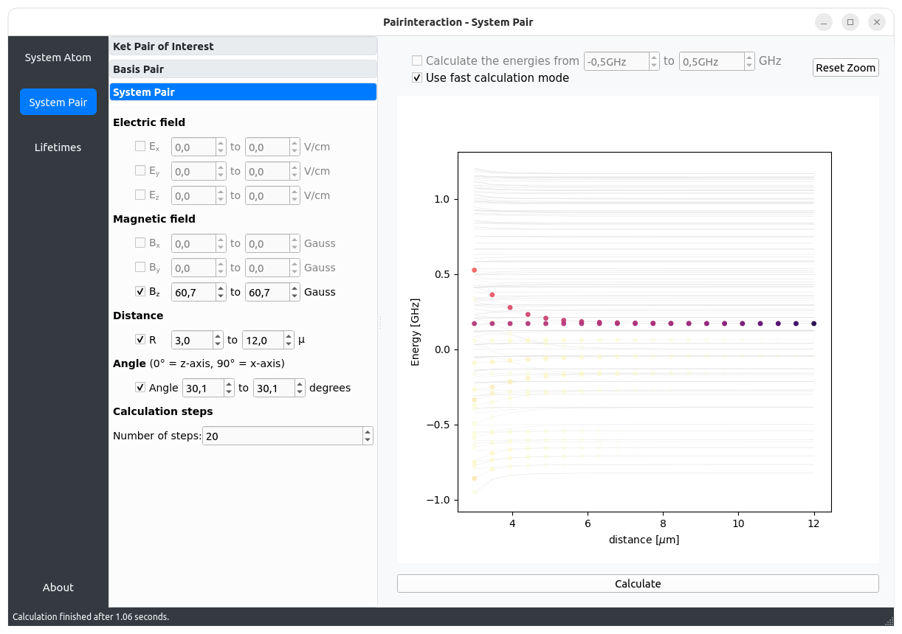

Tutorials
=========

The pairinteraction software comes with a graphical user interface (GUI) and a Python API. The GUI provides a quick way
to calculate Rydberg interaction potentials and energy shifts in the presence of external fields. The Python API is
designed to automatize calculations and to have more fine-grained control.

.. _tutorial-api:

Tutorials - Python API
----------------------

**Introduction**

Here we show the usage of the API. The first tutorial serves as a quick start guide.

.. nbgallery::

    examples_python/quick_start
    examples_python/introduction
    examples_python/stark_map
    examples_python/pair_potentials
    examples_python/overview
    examples_python/lifetimes
    examples_python/perturbative_c3_c6

**Applications**

The following jupyter notebooks show how the pairinteraction Python API can be applied to solve complex problems and
reproduce results from literature.

.. nbgallery::

    examples_python/perturbative_h_eff
    examples_python/pair_potential_efield_sensitivity

.. _tutorial-gui:

Tutorials - Graphical User Interface
------------------------------------

After following the :ref:`installation instructions <installation>`, the graphical user interface (GUI) of
pairinteraction can be started by executing

.. code-block:: bash

    pairinteraction gui

from the command line. Here as quick preview of the GUI:

